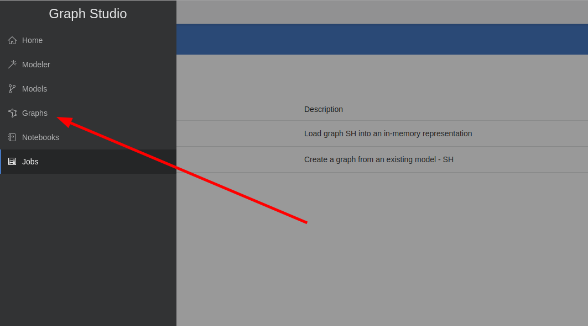

# Create a graph from existing relational data using Graph Studio

## Introduction

In this lab you will explore Graph Studio and learn more about how you can create graphs from existing relational data stored in your 
Autonomous Data Warehouse - Shared Infrastructure (ADW) or Autonomous Transaction Processing - Shared Infrastructure (ATP) instance.

*Note: While this lab uses ADW, the steps are identical for creating and connecting to an ATP database.*

### Objectives

- Learn how to connect to your autonomous database using *Graph Studio*
- Model a graph from the Sales History (SH) sample data set
- Monitor the graph creation job

### Required Artifacts

- The following lab requires an ADW/ATP account. You may use your own account, a cloud account that you obtained through a trial, or a training account whose details were given to you by an Oracle instructor.

## STEP 1: Connect to your autonomous database using Graph Studio

Open Graph Studio in your browser. If you do not have the URL for your Graph Studio ADW/ATP database, the URL pattern is as follows

```
https://adb.<region_identifier>.oraclecloud.com/graphstudio/?tenant=<tenant_name>&database=<database_name>
```

For example, to access Graph Studio of database `ADW1` belonging to tenant `TENANT1` in the US Ashburn (IAD) region, open

```
https://adb.us-ashburn-1.oraclecloud.com/graphstudio/?tenant=TENANT1&database=ADW1
```

in your browser. You can find the [region identifier for all regions here](https://docs.cloud.oracle.com/en-us/iaas/Content/General/Concepts/regions.htm).

Enter your ADW/ATP account credentials into the login screen:


Then click the "Sign In" button.

## STEP 2: Select the tables to create the graph from

1. In the Graph Studio user interface, click on the hamburger menu on the top left corner of the screen:

    

2. In the menu, click on the *Modeler* menu option:

    

    In this lab, we use the Sales History (SH) sample schema to create our demo graph, which is an example dataset that all autonomous databases have available by default. However, you can apply the steps of this lab to any relational data available in your ADW/ATP database, regardless of where the data originated from. All the schemas and tables - including views - that you have access to will show up as possible input tables on the modeler page.

3. Open up the *SH* schema and double click on the *COUNTRIES* table:

    

    You see some details about this table, like all the columns it has and their types, as well as which column is the primary key:

    

4. On the bottom left, click on the *SH.COUNTRIES - Data* tab:

    

    You see a preview of the values of that table. By default, it displays the first ten rows, but you can increase the sample size. You can also search for any value in that table and paginate through the preview:

    

5. For this lab, we choose all tables of the *SH* schema as input for our graph model. Select the *SH* and then click the button in the middle to move all SH tables to the selected section on the right:

    

6. Click on the *Next* button on the top right to move to the next step:

    

## STEP 3: Edit your graph model

1. Give your newly created graph model a name and optionally a description and a few tags to identify it easier later. Then, click the *Create* button:

    

    Graph Studio is now analyzing the relationships in the inputs tables by looking at all the foreign key constraints to suggest how to map the data into a property graph structure. This may take a few seconds. Once done, you see
    all the input tables you selected on the left, and the mapping to vertex and edge tables on the right:

    

2. Click on the *CHANNELS* vertex table:

    

    The automatic graph modeler suggests to convert each row of the *SH.CHANNELS* input table into a vertex in target property graph. In the property graph model, vertex and edges can have a *label* to categorize them into different
    types of vertices and edges. Each label can have a different set of propererties associated with it. The graph modeler automatically sets the label to the name of the input table. That way we can later easily identify of which type
    each vertex or edge in our generated graph is. In addition, we see that each *column* of the input table was converted into a *property* in our graph model. In the property graph model, properties are arbitrary key/value pairs
    associated with each vertex or edge in our graph. By mapping all column values into properties, we make sure that all input data is preserved in our graph. 

    However, the graph modeler allows you to customize how data is mapped and remove unnecessary tables and or columns not relevant for your analysis. Reducing the amount of data to be processed will reduce the amount of processing
    resources and storage required for graph analysis.

3. Remove unnecessary properties by clicking the *X* button next to property we want to delete. In this lab, we remove the *CHANNEL\_CLASS\_ID* and *CHANNEL\_TOTAL\_ID* properties from our model:

    

4. Click on the *SH\_SALES\_2* edge table:

    

    As you can see from the *Source Vertex* and *Destination Vertex* information, this edge type maps all relations from the *SALES* table to the *CUSTOMERS* table. In other words, it models *bought by* relationships.
    By default, the modeler gave this edge type the label *SALES\_CUSTOMER\_FK*.

5. Rename the edge label to *BOUGHT\_BY*:

    

6. Click on the *Source* tab on the bottom left:

    

    You see the source code for this model. The source code is written in PGQL Data Definiton Language (DDL) syntax. You can find more information about the language in the 
    [PGQL 1.3 specification](https://pgql-lang.org/spec/1.3/#create-property-graph).

    Advanced users can edit the source code directly. Changes will be reflected immediately in the designer view and vice versa.

7. Click the *Preview* tab on the bottom left:

    

    You see a visual representation of our graph model so far. Each circle in the graph represents a vertex type (label). And edge relationship in the graph represents an edge type (label)
    in between the circles. You can rearrange the graph by clicking and dragging elements around. You can also right click on each element to see the list of properties it will contain.
    In this view, we can easily identify that the *SUPPLEMENTARY\_DEMOGRAPHICS* vertex table does not have any relation to any other vertex tables. 
    
    
    
    How can we remove this vertex table from our model?

8. Click on the *Designer* tab:

    

9. Click on the *SUPPLEMENTARY\_DEMOGRAPHICS* vertex table

    

10. Click on the *Delete* icon on the top right:

    

11. In dialog confirming the deletion, choose *Yes*.

12. Go back to *Preview* mode. You will notice the *SUPPLEMENTARY\_DEMOGRAPHICS* vertex table is gone from our visual representation of the model.

13. Click *Next* on the top right:

    

    You see a summary of the model we created. All the input tables and how we want to map those to a property graph.

## STEP 4: Start the graph creation job

1. Click *Create Graph* on the top right:

    

2. Enter *SH* as graph name and optionally give the graph a description and some tags to identify it easier later. Leave the *Load into memory* option checked. Then click *Create*:

    

    You get redirected to the jobs page where you see your graph creation job.

3. Click on the running job. In the details section, click on the *Logs* icon on the top right:

    

    You can leave the resulting logs dialog open to monitor the progress of the graph creation. Graph Studio automatically refreshes the logs once every few seconds.
    The graph creation job should succeed after a few minutes. After completion, another *Load into memory* job is started automatically. 

4. Wait for both jobs to complete successfully:

    

## STEP 5: Inspect the created graph and model

1. Click on the *Graphs* menu item:

    

2. Click on the *SH* graph that we just created:

    

    You can see a preview of the graph, edit its name or meta data, share it with others, load it into memory or delete it.

3. Click on the *Models* menu item:

    

4. Click on the *SH Model* that we just created:

    

    Just like the graph, the model is stored as well. You can see the source code of this model, share it with others, edit its meta data or delete it.
    You can also kick off another graph creation job from the same model.

Congratulations! You successfully converted relational tables into a property graph. You can now go ahead and analyze the relationships in that data using powerful graph queries and algorithms.

Please proceed to the next lab.

## Acknowledgements

- **Author** - Korbi Schmid, ADB Graph Development
- **Last Updated By/Date** -

See an issue?  Please open up a request [here](https://github.com/oracle/learning-library/issues).