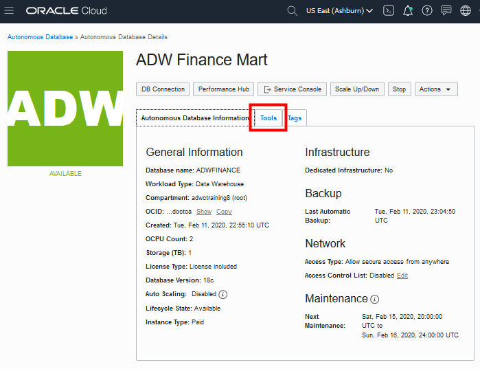
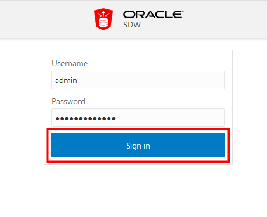
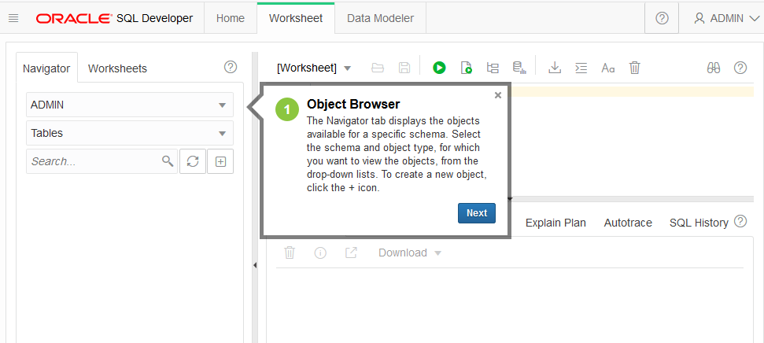
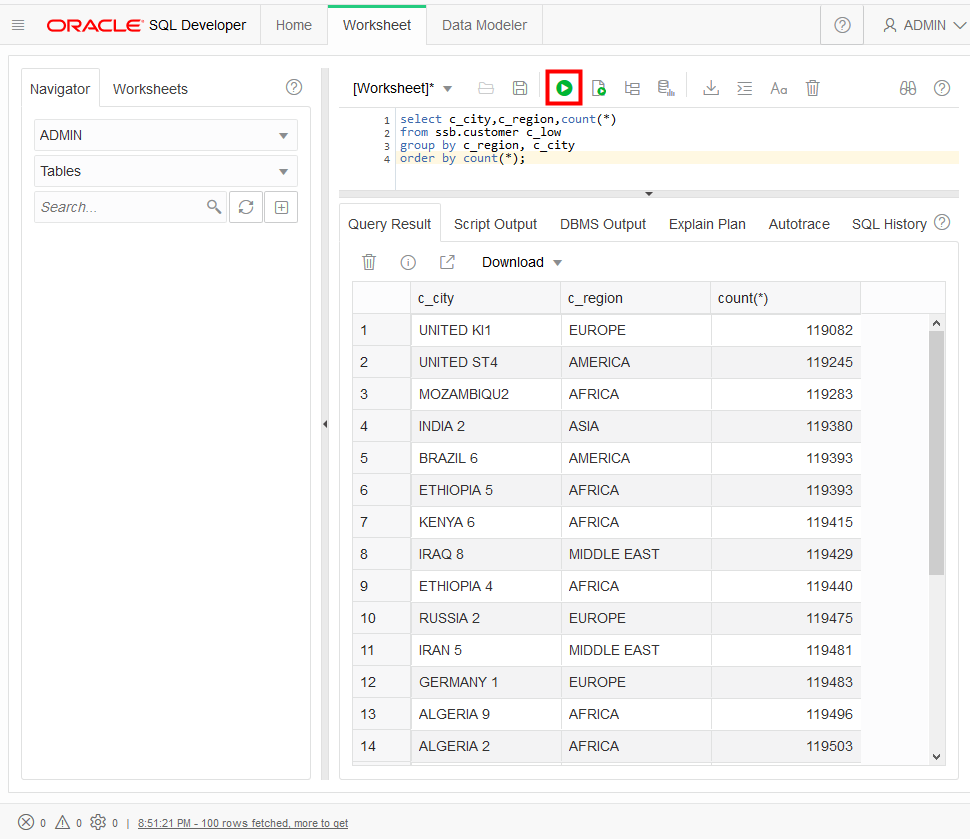

# Create your first graph using Graph Studio of the Autonomous Database

## Introduction

In this lab you will explore Graph Studio and learn more about how you can create graphs using data stored in your Autonomous Data Warehouse (ADW) or Autonomous Transaction Processing ATP) instance.

*Note: While this lab uses ADW, the steps are identical for creating and connecting to an ATP database.*


### Objectives
- Learn how to enable users of your autonomous database to create graphs
- Learn how to connect to your autonomous database using *Graph Studio*
- Model a graph from the Human Resources (HR) sample data set
- hello hello

### Required Artifacts

-   The following lab requires an Oracle Cloud account. You may use your own cloud account, a cloud account that you obtained through a trial, or a training account whose details were given to you by an Oracle instructor.

### Lab Prerequisites

This lab assumes you have completed the *Login to Oracle Cloud* and *Provision ADB* labs.

### Enable users to create graphs

## STEP 1: Connect with SQL Developer Web

1. In your database's details page, click the **Tools** tab.

    

2. In the SQL Developer Web box, click **Open SQL Developer Web**.
3. A sign in page opens for SQL Developer Web. Use your database instance's default administrator account, ADMIN, with the admin password you specified when creating the database. Click **Sign in**.

    

4. SQL Developer Web opens on a worksheet tab. The first time you open SQL Developer Web, a series of pop-up informational boxes introduce the main features.

    


## STEP 2: Run Scripts in SQL Developer Web

1. Copy and paste the code snippet below to your SQL Developer Web worksheet. This query will run on the Star Schema Benchmark, one of the two ADW sample data sets that may be accessed from any ADW instance. Take a moment to examine the script. Then click the **Run Script** button to run it. Make sure you click the Run Script button in SQL Developer Web so that all the rows are displayed on the screen.

    ````
    <copy>
    select /* low */ c_city,c_region,count(*) 
    from ssb.customer c_low
    group by c_region, c_city
    order by count(*);
    </copy>
    ````

    

2. Take a look at the output response from your Autonomous Data Warehouse.

3.  When possible, ADW also *caches* the results of a query for you. If you run identical queries more than once, you will notice a much lower response time when your results have been cached.

## STEP 3: Experiment with running other sample queries

1. You can find more sample queries to run in the ADW documentation.  Try some of the queries from the ADW Documentation <a href="https://docs.oracle.com/en/cloud/paas/autonomous-data-warehouse-cloud/user/sample-queries.html" target="\_blank">here</a>.

Please proceed to the next lab.

## Acknowledgements

- **Author** - Nilay Panchal, ADB Product Managemnt
- **Last Updated By/Date** - Richard Green, DB Docs Team, March 2020

See an issue?  Please open up a request [here](https://github.com/oracle/learning-library/issues).