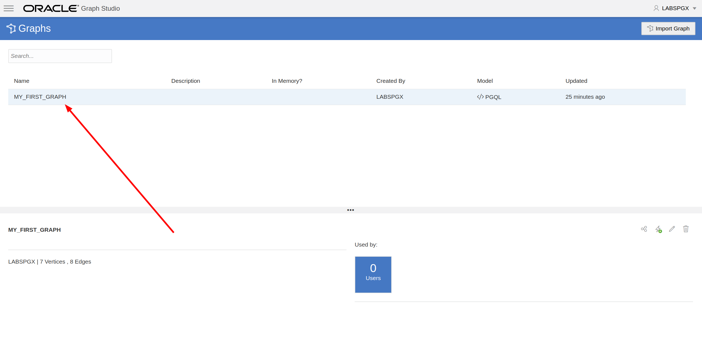
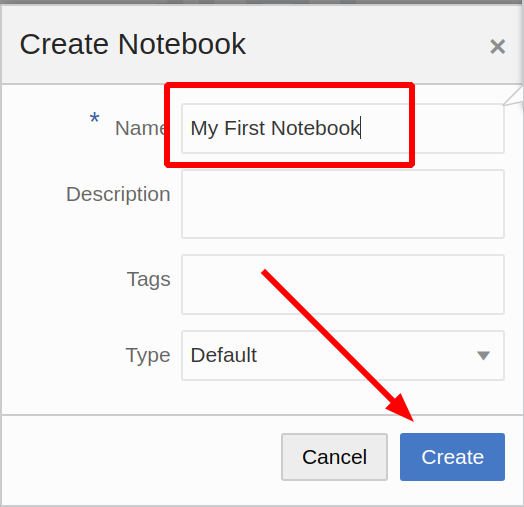

# Create, analyze and visualize a graph from scratch

## Introduction

In this lab you will explore Graph Studio and learn how you can create and analyze a graph from scratch very quickly using
Autonomous Data Warehouse - Shared Infrastructure (ADW) or Autonomous Transaction Processing - Shared Infrastructure (ATP) instance.

*Note: While this lab uses ADW, the steps are identical for creating and connecting to an ATP database.*

### Objectives

Learn how to
- connect to your autonomous database using *Graph Studio*
- quickly create a very simply graph from scratch using PGQL
- load graphs into memory for analysis
- create a simple notebook
- write and execute basic Markdown, PGX Java and PGQL notebook paragraphs
- visualize graph data
- do all of the above *in under 5 minutes*!

### Required Artifacts

- The following lab requires an ADW/ATP account. You may use your own account, a cloud account that you obtained through a trial, or a training account whose details were given to you by an Oracle instructor.

## STEP 1: Connect to your autonomous database using Graph Studio

Open Graph Studio in your browser. If you do not have the URL for your Graph Studio ADW/ATP database, the URL pattern is as follows

```
https://adb.<region_identifier>.oraclecloud.com/graphstudio/?tenant=<tenant_name>&database=<database_name>
```

For example, to access Graph Studio of database `ADW1` belonging to tenant `TENANT1` in the US Ashburn (IAD) region, open

```
https://adb.us-ashburn-1.oraclecloud.com/graphstudio/?tenant=TENANT1&database=ADW1
```

in your browser. You can find the [region identifier for all regions here](https://docs.cloud.oracle.com/en-us/iaas/Content/General/Concepts/regions.htm).

Enter your ADW/ATP account credentials into the login screen:


Then click the "Sign In" button.

## STEP 2: Create a simple graph using PGQL

1. In the Graph Studio user interface, click on the hamburger menu on the top left corner of the screen:

    

2. Click on the "PGQL Playground" menu item:

    

3. Copy and paste the following DDL code into the PGQL input text area:

    ```
    CREATE PROPERTY GRAPH my_first_graph;

    INSERT INTO my_first_graph
        VERTEX austin LABELS (City) PROPERTIES (austin.name = 'Austin', austin.population = 964254),
        VERTEX tokyo LABELS (City) PROPERTIES (tokyo.name = 'Tokyo', tokyo.population = 9273672),
        VERTEX zurich LABELS (City) PROPERTIES (zurich.name = 'Zurich', zurich.population = 402762),
        VERTEX europe LABELS (Continent) PROPERTIES (europe.name = 'Europe'),
        VERTEX US LABELS (Country) PROPERTIES (US.name = 'United States of America'),
        VERTEX texas LABELS (State) PROPERTIES (texas.name = 'Texas', texas.area_size_km2 = 695662),
        VERTEX japan LABELS (Country) PROPERTIES (japan.name = 'Japan', japan.area_size_km2 = 377975),
        EDGE austinCapital BETWEEN austin AND texas LABELS (capital_of),
        EDGE austinCountry BETWEEN austin AND US LABELS (located_in),
        EDGE texasCountry BETWEEN texas AND US LABELS (located_in),
        EDGE zurichContinent BETWEEN zurich AND europe LABELS (located_in),
        EDGE tokyoCapital BETWEEN tokyo AND japan LABELS (capital_of),
        EDGE tokyoCountry BETWEEN tokyo AND japan LABELS (located_in),
        EDGE zurichTokyo BETWEEN zurich AND tokyo LABELS (connecting_flight) PROPERTIES (zurichTokyo.distance_km = 9576),
        EDGE zurichAustin BETWEEN zurich AND austin LABELS (connecting_flight) PROPERTIES (zurichAustin.distance_km = 8674)
    ```

    This will create a very simple graph with 7 vertices and 8 edges. For more information about the syntax, please refer to the [PGQL specification](https://pgql-lang.org/spec/1.3/#inserting-vertices)

4. Click the Execute button on the top right:

    

## STEP 3: Load the graph into memory

1. Navigate to the Graphs page:

    

2. Click on `MY_FIRST_GRAPH`:

    

3. Click on the *Load into memory* icon on the top right of the details section:

    

    In the resulting dialog, click *Yes*.

4. You get redirected to the Jobs page. Wait for the job to complete:

    

## STEP 4: Create your first notebook

1. Navigate to the Notebooks page:

    

2. Click the *Create* button:

    

3. Name the notebook *My First Notebook*, then click *Create*:

    

4. Enter the following text into the first paragraph:

    ```
    %md
    # My First Notebook

    This is my first paragraph
    ```

    By starting the paragraph with `%md`, we indicate that the paragraph input is Markdown code. 

5. Execute the paragraph:

    

    You will see the Markdown code rendered as HTML:

    

    Markdown paragraphs are useful to add explanations to your notebooks and order them into chapters. You can embed images and even videos using Markdown or HTML syntax, give it a try.

## STEP 5: Analyze, query and visualize the graph

1. Add another paragraph to the notebook by clicking the *+* button below the first paragraph and enter the following:

    ```
    %pgx-java
    var graph = session.getGraph("MY_FIRST_GRAPH")
    ```

2. Execute that paragraph, you will see we successfully referenced our graph that we just created from scratch via the PGX Java APIs:

    

3. Modify the paragraph to run a graph algorithm. For example:

    ```
    %pgx-java
    var graph = session.getGraph("MY_FIRST_GRAPH")
    analyst.countTriangles(graph, true)
    ```

4. Execute the updated paragraph again. You see that we computed the graph contains exactly one triangle:

    

5. Add a PGQL paragraph as follows:

    ```
    %pgql
    select v, e from match (v)-[e]->() on MY_FIRST_GRAPH
    ```
    
6. Execute that paragraph, you see the full rendered visually:

     

7. Right click on one of the vertices on the screen to see all the details of that vertex.

8. Click on the settings icon of the visualization:

     

9. Navigate to the *Visualization* tab and select *NAME* as the label to render next to the vertices:

        

    You now see the name next to each vertex, which will help you better understand the visualization. There are lots of other options to help you make sense of the graph. Feel free to play around with the settings as you like.

10. Add another paragraph with the following query and execute it:

    ```
    %pgql
    select c.NAME, c.POPULATION from match (c:City) on MY_FIRST_GRAPH order by c.POPULATION desc
    ```

11. Change the output to be a pie chart:

       

Congratulations! You successfully created, analyzed and visualized a graph from scratch using Graph Studio. Hopefully this little example gave you a feeling of how can use your Autonomous Database as a graph database. Please
proceed to the next lab to see more complex examples of how to create and analyze graphs.

## Acknowledgements

- **Author** - Korbi Schmid, ADB Graph Development
- **Last Updated By/Date** -

See an issue?  Please open up a request [here](https://github.com/oracle/learning-library/issues).