# Analyze a typical data warehouse with graph algorithms in a notebook

## Introduction

In this lab you will learn how to run graph algorithms and PGQL queries using notebooks directly in the Graph Studio interface of your 
Autonomous Data Warehouse - Shared Infrastructure (ADW) or Autonomous Transaction Processing - Shared Infrastructure (ATP) instance.

*Note: While this lab uses ADW, the steps are identical an ATP database.*

### Objectives

- Learn how to prepare graph data to be analyzed in notebooks
- Learn how to create a run explanatory paragraphs using Markdown syntax
- Learn how to create a run graph query paragraphs using PGQL
- Learn how to visualize graph query results
- Learn how to create a run graph algorithm paragraphs using the PGX Java APIs

### Required Artifacts

- The following lab requires an ADW/ATP account. You may use your own account, a cloud account that you obtained through a trial, or a training account whose details were given to you by an Oracle instructor.

### Lab Prerequisites

- This lab assumes you have completed the [Create a Graph from existing relational data using Graph Studio](?lab=lab-1-model-graph) lab, meaning you have a graph named *SH* created in the *Graphs* page of Graph Studio.

## STEP 1: Make sure the SH graph is loaded into memory.

Before graphs can be analyzed in a notebook, we need to make sure the graph is loaded into memory. In the Graph Studio user interface, navigate to the *Graphs* page, verify whether the *SH* graph is loaded 
into memory or not:

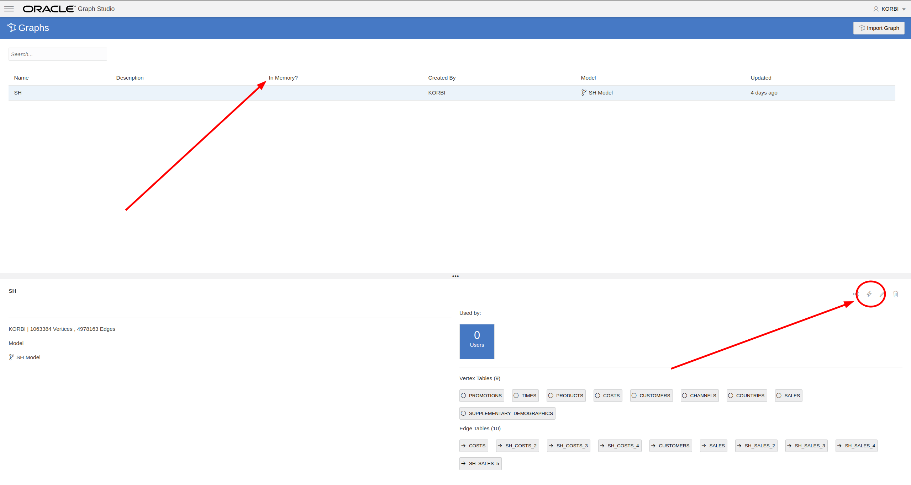

If the graph is loaded into memory (it says "&#x1F5F2; in memory"), then you can proceed to STEP 2.

If the graph is *not* loaded into memory just like in above screenshot, click the *Load into memory* icon on the top right of the details section. In the resulting dialog, click *Yes*:

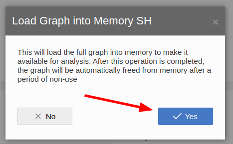

This will create a "Load into Memory" job for you. Wait for this job to finish:

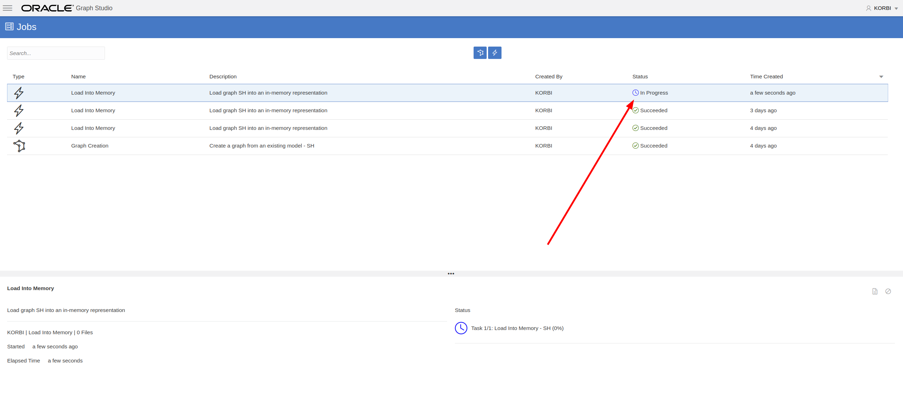

## STEP 2: Clone the Sales History analysis example notebook

1. Open on the hamburger menu on the top left corner of the screen and click on *Notebooks*:

    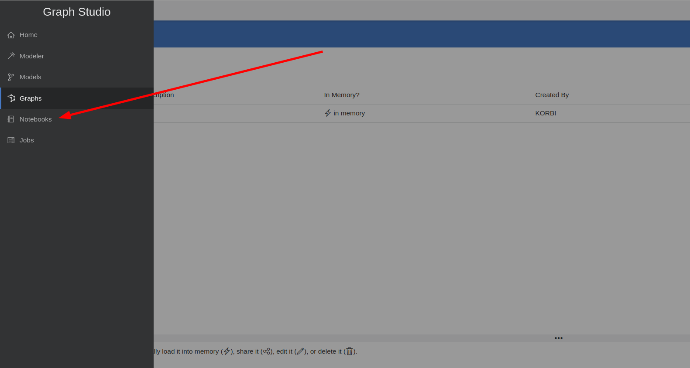

2. Open the *Use Cases* folder:

    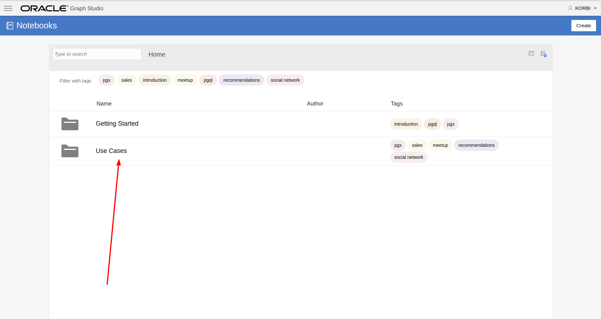

3. Click on the *Sales Analysis* notebook:

    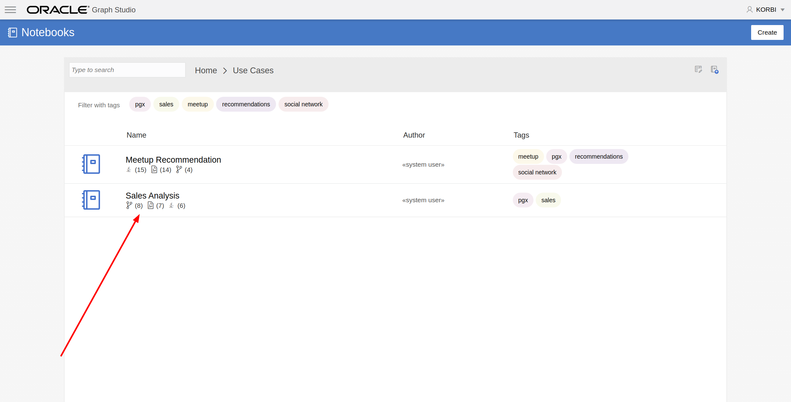

4. The *Sales Analysis* notebook is a *built-in* notebook. You can identify *built-in* notebooks by the author being shown as `<<system-user>>`. Built-in notebooks are shared between all users and therefore read-only and locked.
   To execute the notebook, we need to create a private copy first and then unlock it. On the top of the notebook, click the *Clone* button:

    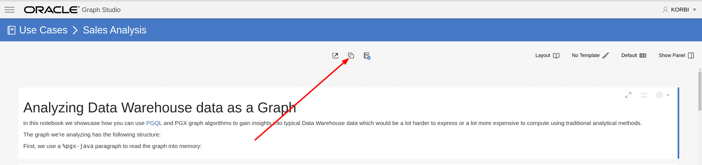

5. In the resulting dialog, give the cloned notebook a unique name so you can find it later again easily. Folder structures can be expressed by using the `/` symbol. Then click *Create*:

    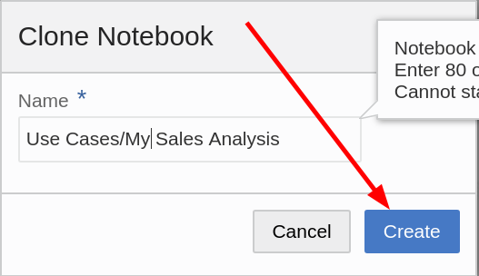

6. Click the *Unlock* button on the top right of the cloned notebook:

    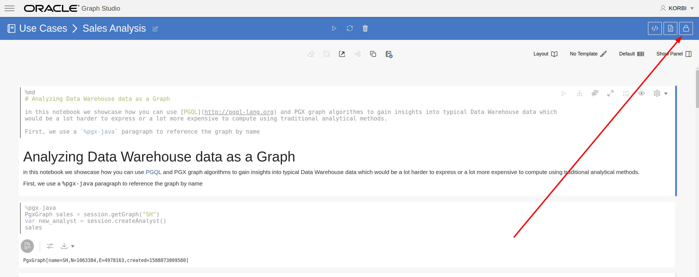

    The notebook is now ready to execute.

## STEP 3: Explore the basic notebook features

Each notebook is organized into a set of *paragraphs*. Each paragraph has an input (called *Code*) and an output (called *Result*). In Graph Studio, there are 3 types of paragraphs:

1. Markdown paragraphs start with `%md`
2. PGQL paragraphs start with `%pgql`
3. PGX Java paragraphs start with `%pgx-java`

In the Sales Analysis notebook, you can find examples of for each of those types. The notebook is designed to work with the graph created in the previous lab, so you do not have to 
modify any code to make the paragraphs execute.

1. To execute the first paragraph, click the *Run* icon on the top right of the paragraph:

    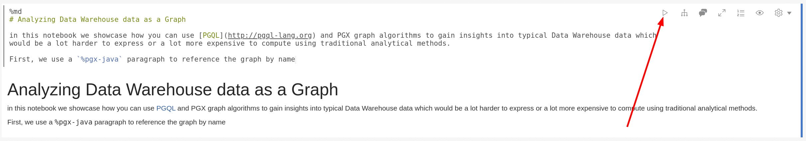

2. The second paragraph illustrates how to reference graphs loaded into memory in `%pgx-java` paragraphs. You simply reference them by using the `session.getGraph("SH")` API:

    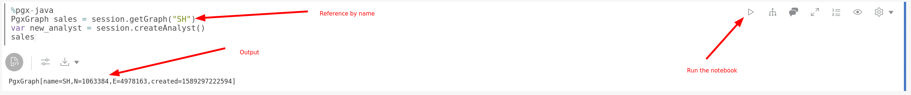

3. The third paragraph illustrates how you can visualize results using charts. You'll notice that you only see a chart, but no code. In the notebooks, you can hide the input for a paragraph. This is useful for generating
    reports. To show the code, click on the eye icon on the top right of the paragraph and check the *Code* box:

    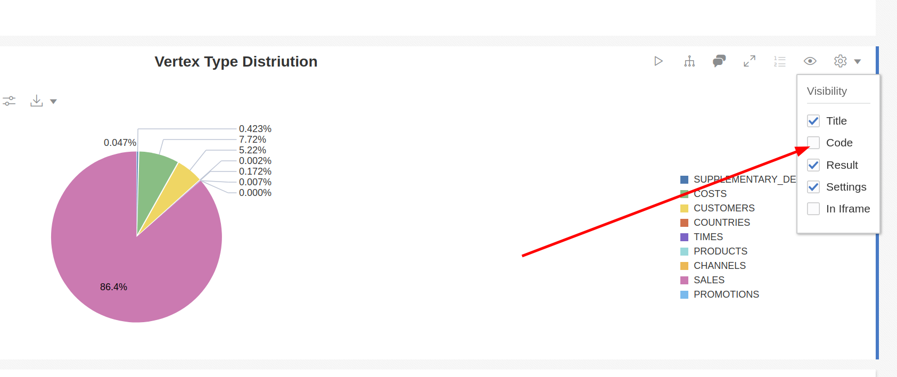

    Any paragraph which produces tabular results can be visualized using charts. To produce a tabular result, make sure the output encodes each row separated by \n (newline) and column separated by \t (tab) with first row as header row.
    That is what this paragraph is doing to visualize the distribution of vertex types in our graph using a pie chart.

4. Click on the chart types to explore different chart visualizations and their configuration options:

    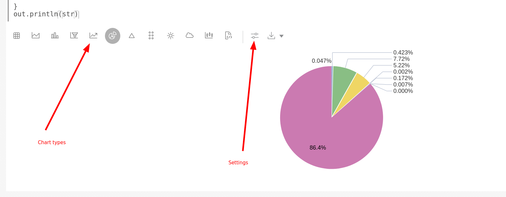

5. The next two paragraphs illustrate a typical data warehouse query, but expressed in PGQL instead of SQL. In PGQL queries, you reference which graph to query by using the `MATCH ... ON <graphName>` syntax. 
    Notice that `%pgql` paragraphs return tabular format by default, so you do not have to do any conversion to visualize the result of PGQL queries as charts:

    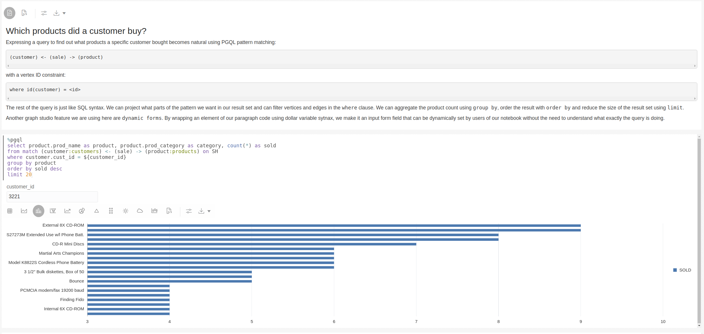

6. Note the use of *dynamic forms* in this first `%pgql` paragraph. If you use the form syntax as shown in that paragraph inside the query, the notebook will automatically render an input field and use 
    the value you specify in the input field when executing the query: 

    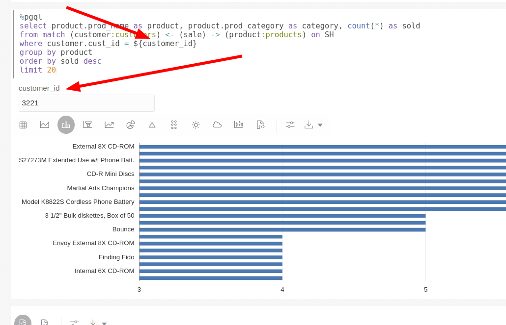

    If you combine this feature with the ability to hide the *Code* section of the paragraph, you can turn notebooks into zero-code applications that users can execute with various parameters without any programming knowledge.
    Apart from text input, there's also support for dropdown and other types of forms. Please check the Autonomous Graph User's guide for the full reference.

## STEP 3: Play with graph visualization

1. Run this paragraph which shows an example of how to visualize PGQL queries as a graph:

    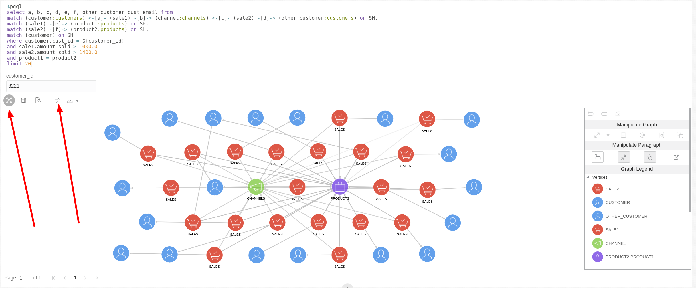

    Any non-complex PGQL query can also be rendered as a graph instead of a table or chart. Exceptions to this are queries which do not return singular entities like queries that contain `GROUP BY` or
    or other aggregations. Click on the *Settings* button to explore all the graph visualization options. You can choose what properties to render next to an vertex or edge, what graph layout to use
    and much more. Try to change of few settings to see the effect.

2. In the graph visualization settings, open the *Highlights* tab:

    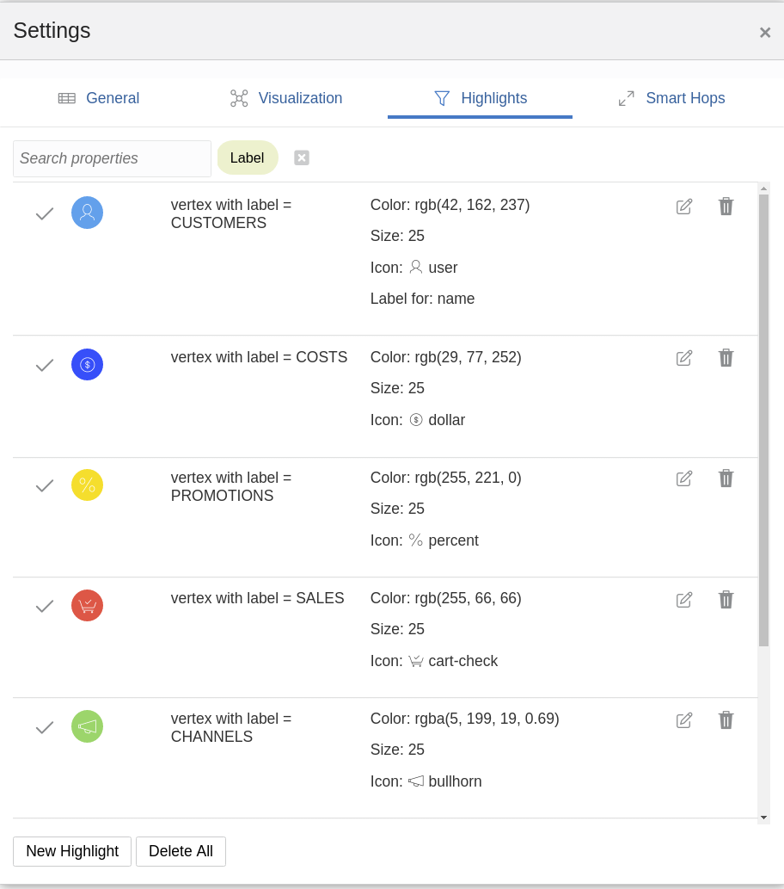

    By using *Highlights*, you can emphasize certain elements in your graph by giving them a different color, icon, size, etc. than others based on certain conditions. As you can see, here we added a few
    highlights to render different types of vertices differently based on a label condition. Try to create your own hightlight or edit an existing one to see how it affects the output, by clicking the
    *New Highlight* and *Edit Highlight* buttons respectively.

3. Close the settings dialog again and do a right-click on one of the vertices. It will show all the associated properties of that vertex. The properties which are part the projection of the original
    PGQL query are shown in bold:

    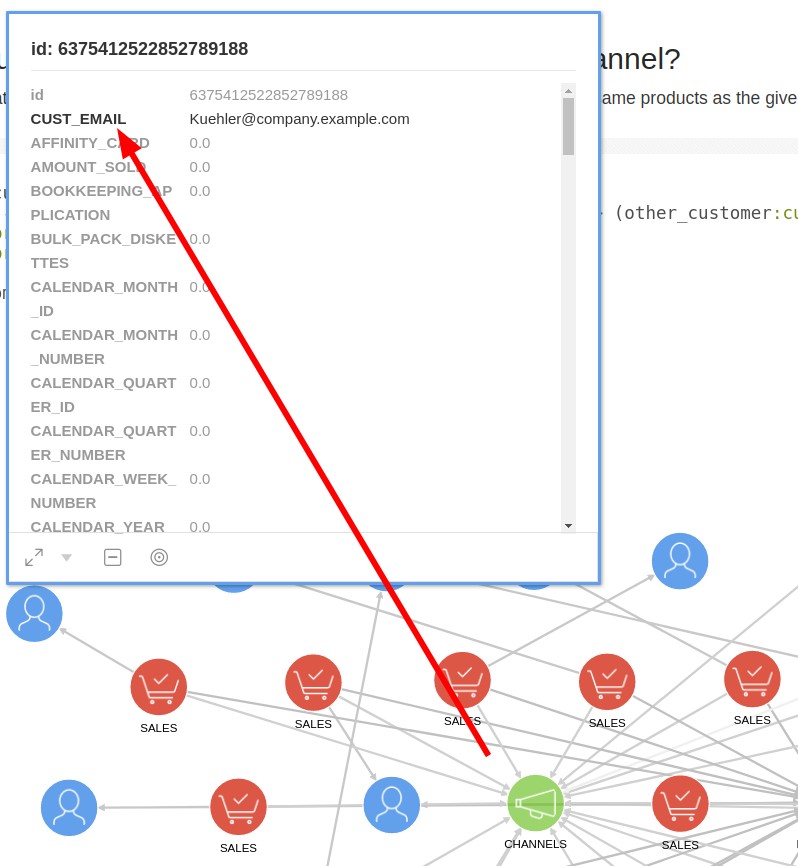

## STEP 4: Play with graph exploration 

The graph visualization feature allows you to further *explore* the graph visually directly in the visualization canvas.

1. Click on one of the vertices in the rendered graph:

    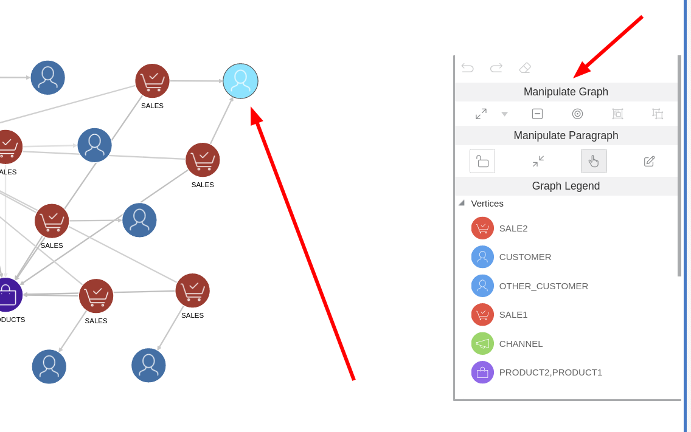

    You'll notice that the graph manipulation toolbar on the right side gets enabled.

2. Click on the *Expand* action:

    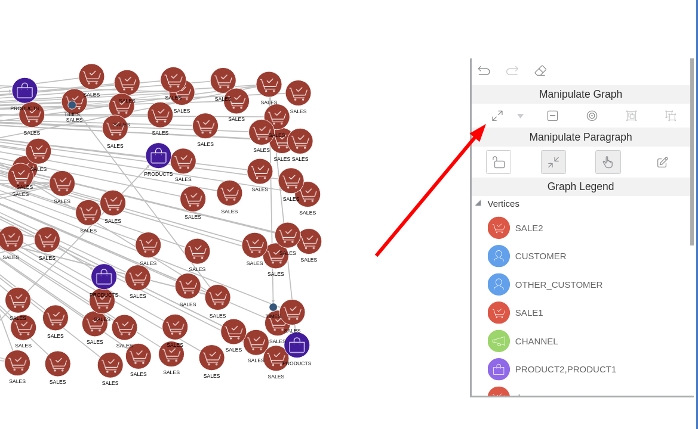

    Expand will show you all the neighbors of the selected vertex, up to 2 hops. You can decrease or increase the number of hops in the graph visualization settings dialog:

    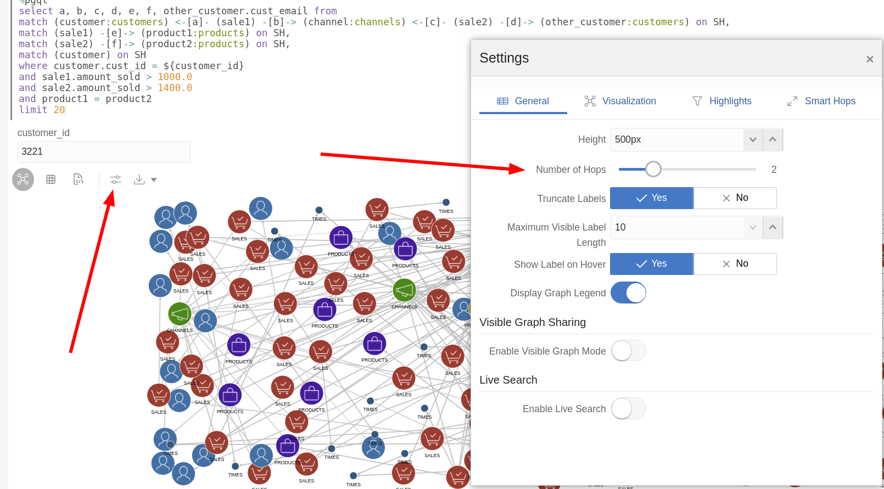

3. The graph manipulation toolbar provides a convenient *Undo* option to reverse the previous manipulation. Click it to remove the expanded vertices again:

    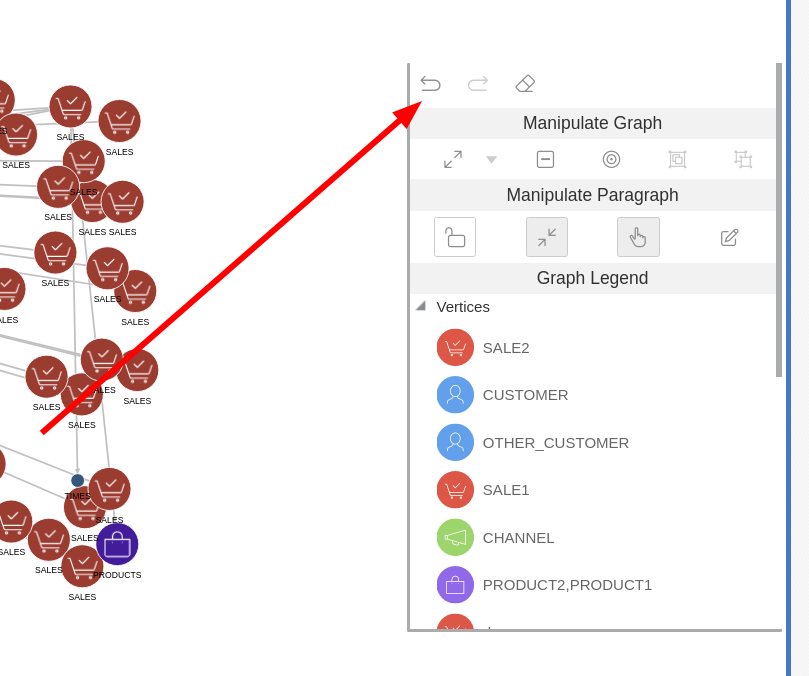

4. Select a vertex again, this time click *Focus*. Focus is like *Expand*, but it will remove all the other elements on the canvas:

    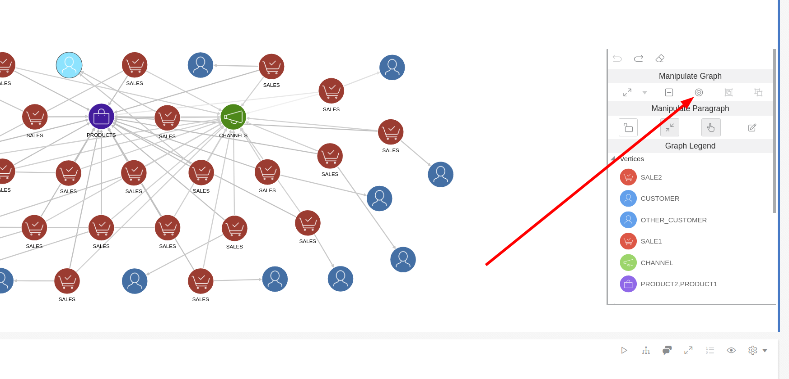

5. Next, try to group several vertices into one group. For that, hold the mouse down and drag over the canvas to select a group of vertices. Then click the *Group* button:

    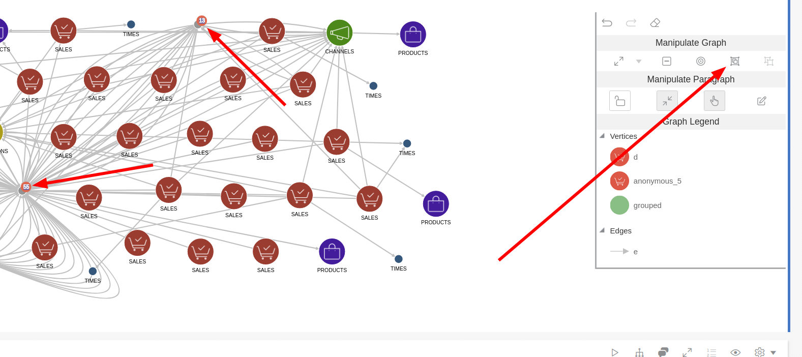

    You can create as many groups as you want. That way you can group noisy elements into a single visible group without actually dropping them from the screen. The little number
    next to a group tells you how many elements are in that group. 
    
6. To ungroup the elements again later, click on the group and then click the *Ungroup* icon:

    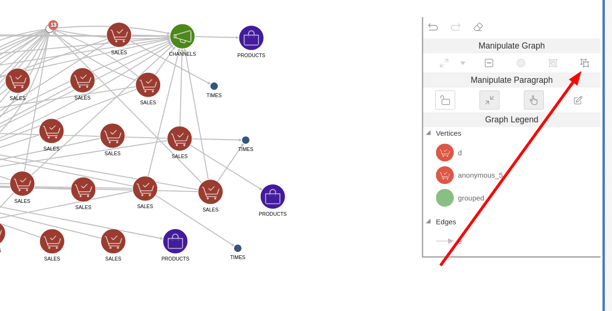

7. You can also drop indivdual elements from the visualization. Click on a vertex and then click the *Drop* action:

    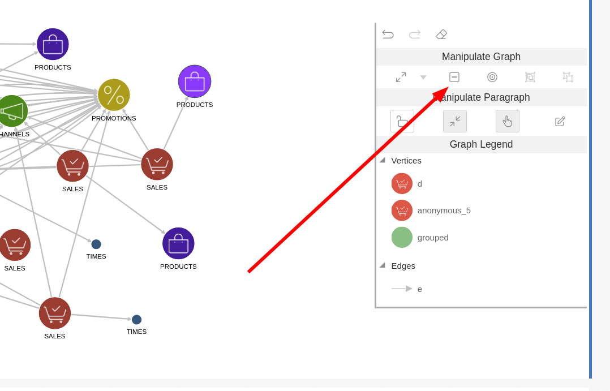

    You can also drop a group of elements. Simply select all the vertices and edges you want to drop by click&drag on the canvas, then click the *Drop* icon.

8. Paragraph results can be expanded into a full screen to give you more space for graph manipulation. Click the *Expand* button on the top right of the paragraph to enter fullscreen mode:

    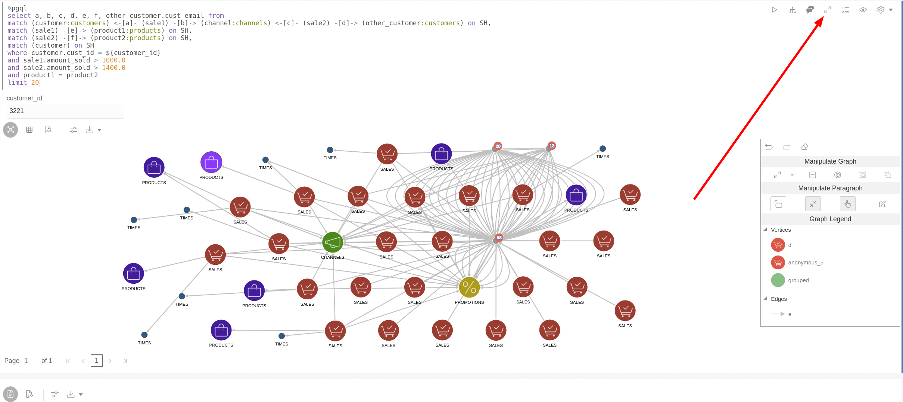

    Click the same button again to go back to normal screen.

9. Lastly, to go back to our initial state of the visualization, click the *Reset* icon in the manipulation toolbar. This will revert all the temporary changes we made to the result:

    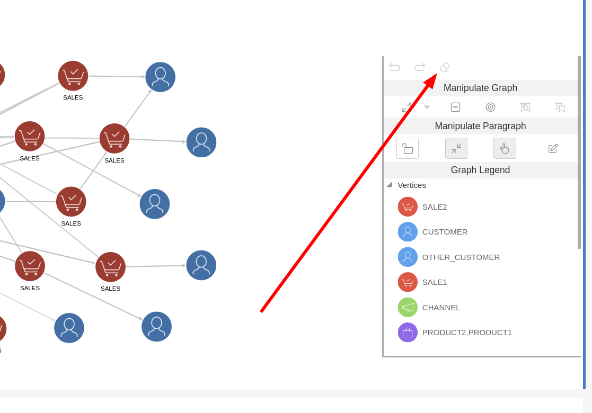
    
## STEP 5: Find the most important products and recommendations using graph algorithms

The example notebook contains two paragraphs illustrating how you can use graph algorithms to gain new insights into your data.

1. Scroll down to the *Find the most important products* paragraph and familiarize yourself how the algorithm works by reading the Markdown description. In the first paragraph, we run the
    graph algorithm by invoking the corresponding PGX API. The result of the algorithm is stored in a new vertex property which we call `centrality`. In the paragraph below, we query
    that newly computed property and order the result by centrality value. This example shows you how you can combine algorithms and PGQL queries to quickly rank elements in your graph:

    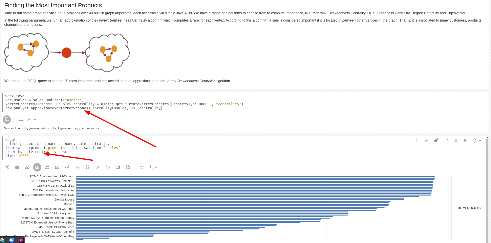

    Go ahead and run those paragraphs yourself.

2. The next few paragraphs illustrate how you can leverage the built-in *Personalize PageRank* algorithm to recommend products to a particular customer. Familiarize yourself how the algorithm works 
    by reading the Markdown description. We again run the algorithm via an easy PGX API invocation and then query the result using PGQL. This time we use two queries. The first one shows you the
    products that the customer already bought. The second query shows the products recommended to buy next:

    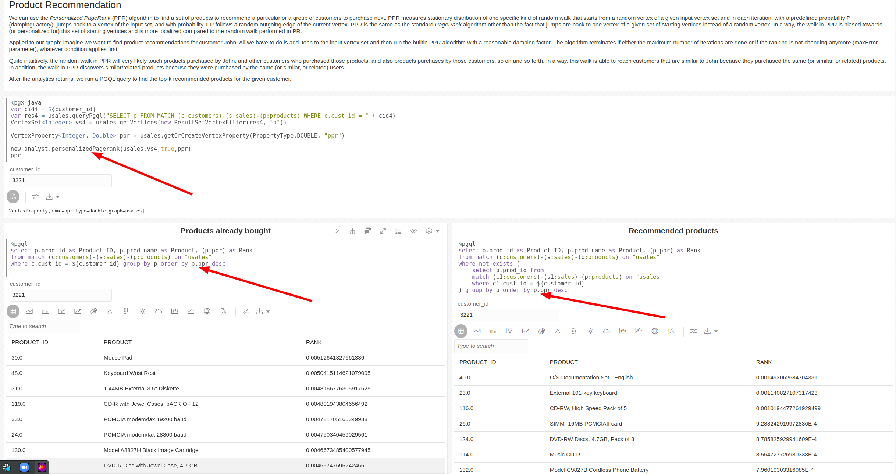

Congratulations! You successfully finished the lab. 

## Acknowledgements

- **Author** - Korbi Schmid, ADB Graph Development
- **Last Updated By/Date** -

See an issue?  Please open up a request [here](https://github.com/oracle/learning-library/issues).