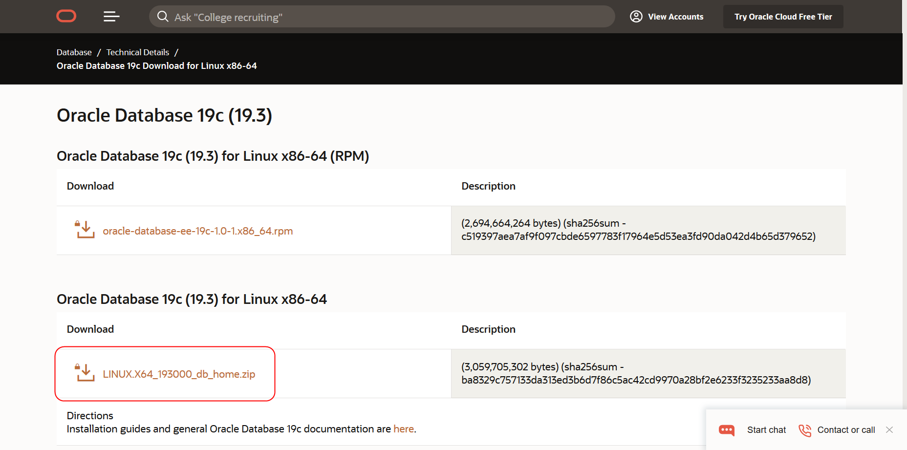

# Build the Oracle Database Docker Image
## Before You Begin

This lab walks you through the steps to build an Oracle Database Docker image on an Oracle Cloud Compute instance.

### Background
A Docker image contains all of the necessary code to execute an application for a host kernel. In this lab, you will create a Docker image for Oracle Database 19c.

### What Do You Need?

* An Oracle Cloud paid account or free trial. To sign up for a trial account with $300 in credits for 30 days, click [here](http://oracle.com/cloud/free).
* SSH keys
* Docker installed on an Oracle Cloud Compute instance.

## **STEP 1**: Install Docker build files from GitHub

Oracle has provided a complete set of Docker build files on an Oracle GitHub repo. There are several ways to get the files to the compute instance, but for simplicity, you will use GitHub's download option.

1. If you don't have an open SSH connection to your compute instance, open and terminal window and connect using the public IP address of your compute instance:

    ```
    $ <copy>ssh -i ./myOracleCloudKey opc@</copy>123.123.123.123
    Enter passphrase for key './myOracleCloudKey':
    [opc@oraclelinux77 ~]$
    ```

2. Use the `wget` to download the repo on the compute instance:

    ```
      [opc@oraclelinux77 ~]$ <copy>wget https://github.com/oracle/docker-images/archive/master.zip</copy>
    --2020-04-07 18:23:39--  https://github.com/oracle/docker-images/archive/master.zip
    Resolving github.com (github.com)... 140.82.112.4
    Connecting to github.com (github.com)|140.82.112.4|:443... connected.
    HTTP request sent, awaiting response... 302 Found
    Location: https://codeload.github.com/oracle/docker-images/zip/master [following]
    --2020-04-07 18:23:39--  https://codeload.github.com/oracle/docker-images/zip/master
    Resolving codeload.github.com (codeload.github.com)... 140.82.112.10
    Connecting to codeload.github.com (codeload.github.com)|140.82.112.10|:443... connected.
    HTTP request sent, awaiting response... 200 OK
    Length: unspecified [application/zip]
    Saving to: ‘master.zip’

        [  <=>                                                                                      ] 2,797,020   12.1MB/s   in 0.2s

    2020-04-07 18:23:39 (12.1 MB/s) - ‘master.zip’ saved [2797020]

    [opc@oraclelinux77 ~]$
    ```
3. Unzip the repo on your compute instance:

    ```
    [opc@oraclelinux77 ~]$ <copy>unzip master.zip</copy>
    Archive:  master.zip
    7e03e466934753bc547c1919729702e5f33e4eba
       creating: docker-images-master/
    ...
       creating: docker-images-master/OracleWebLogic/samples/wls-k8s-domain/k8s/
      inflating: docker-images-master/OracleWebLogic/samples/wls-k8s-domain/k8s/pv.yml
      inflating: docker-images-master/OracleWebLogic/samples/wls-k8s-domain/k8s/pvc.yml
      inflating: docker-images-master/OracleWebLogic/samples/wls-k8s-domain/k8s/secrets.yml
      inflating: docker-images-master/OracleWebLogic/samples/wls-k8s-domain/k8s/wls-admin.yml
      inflating: docker-images-master/OracleWebLogic/samples/wls-k8s-domain/k8s/wls-stateful.yml
      inflating: docker-images-master/README.md
    [opc@oraclelinux77 ~]$
    ```

## **STEP 2**: Upload Oracle Database zip to your compute instance

1. Download Oracle Database 19c (19.3) for Linux x86-64 to your local machine from [Oracle Technology Network](https://www.oracle.com/database/technologies/oracle19c-linux-downloads.html).

  

2. To transfer the zip file to your compute instance, connect using `sftp` and the public IP address of your compute instance:

    ```
    <copy>sftp -i ./myOracleCloudKey opc@</copy>123.123.123.123
    Enter passphrase for key './myOracleCloudKey':
    Connected to 129.213.35.186.
    s
    ```

3. Change to the local directory (on your PC) where you downloaded Oracle Database:

    ```
    s     lcd <path to the zip file on your PC>
    s
    ```

4. Change directories on the compute instance to the `19.3.0` directory of the Docker repo. It is important that you put the Oracle Database installation zip file into the directory that is named the same as the Database version.


    ```
    s     <copy>cd docker-images-master/OracleDatabase/SingleInstance/dockerfiles/19.3.0</copy>
    s
    ```

5. Use the `put` command to copy the zip file to the Compute instance. When it is complete you can exit `sftp`. Depending on your local internet bandwidth, the upload can take up to 2 hours. **Do not unzip the file.**

    ```
    s     <copy>put LINUX.X64_193000_db_home.zip</copy>
    Uploading LINUX.X64_193000_db_home.zip to /home/opc/docker-images-master/OracleDatabase/SingleInstance/dockerfiles/19.3.0/LINUX.X64_193000_db_home.zip
    LINUX.X64_193000_db_home.zip                                        8%  248MB  29.5MB/s   01:30 ETA
    ...
    LINUX.X64_193000_db_home.zip                                      100% 2918MB  32.4MB/s   01:30
    s     exit
    ```

## **STEP 3**: Build the Docker image

1. In the terminal window connected to your compute instance, change directories to the `dockerfiles` directory:

    ```
    [opc@oraclelinux77 ~]$<copy>cd docker-images-master/OracleDatabase/SingleInstance/dockerfiles</copy>
    [opc@oraclelinux77 dockerfiles]$
    ```

2. Build the Docker image using the `buildDockerImage` script.
   Be sure to read the [README.md](https://github.com/oracle/docker-images/blob/master/OracleDatabase/SingleInstance/README.md) file which explains the build process in greater detail.

    ```
    [opc@oraclelinux77 dockerfiles]$ <copy>./buildDockerImage.sh -v 19.3.0 -e</copy>
    Checking Docker version.
    Checking if required packages are present and valid...
    LINUX.X64_193000_db_home.zip: OK
    ==========================
    DOCKER info:
    Client:
     Debug Mode: false

    Server:
     Containers: 1
      Running: 0
      Paused: 0
      Stopped: 1
     Images: 1
     Server Version: 19.03.1-ol
     Storage Driver: overlay2
    ...
    Complete!
    Removing intermediate container d4a91ea15cd2
     ---> 1e15b546dc1b
    Step 8/21 : FROM base AS builder
     ---> 1e15b546dc1b
    Step 9/21 : ARG DB_EDITION
     ---> Running in e2d78f4cb68a
    Removing intermediate container e2d78f4cb68a
     ---> c13d9fffaed8
    ...
    Step 20/21 : HEALTHCHECK --interval=1m --start-period=5m    CMD "$ORACLE_BASE/$CHECK_DB_FILE" >/dev/null || exit 1
     ---> Running in 644d9dcff8ef
    Removing intermediate container 644d9dcff8ef
     ---> b856ede31404
    Step 21/21 : CMD exec $ORACLE_BASE/$RUN_FILE
     ---> Running in 399866c4d53f
    Removing intermediate container 399866c4d53f
     ---> d2d287fe9685
    Successfully built d2d287fe9685
    Successfully tagged oracle/database:19.3.0-ee

      Oracle Database Docker Image for 'ee' version 19.3.0 is ready to be extended:

        --> oracle/database:19.3.0-ee

      Build completed in 1850 seconds.

    [opc@oraclelinux77 dockerfiles]$
    ```

  Note when the script completes, it lists the new Docker image: `oracle/database:19.3.0-ee`.

  You may now proceed to the next lab.

## Acknowledgements
* **Author** - Gerald Venzl, Master Product Manager, Database Development
* **Adapted for Cloud by** -  Tom McGinn, Learning Architect, Database User Assistance
* **Last Updated By/Date** - Tom McGinn, March 2020

See an issue?  Please open up a request [here](https://github.com/oracle/learning-library/issues).   Please include the workshop name and lab in your request. 
