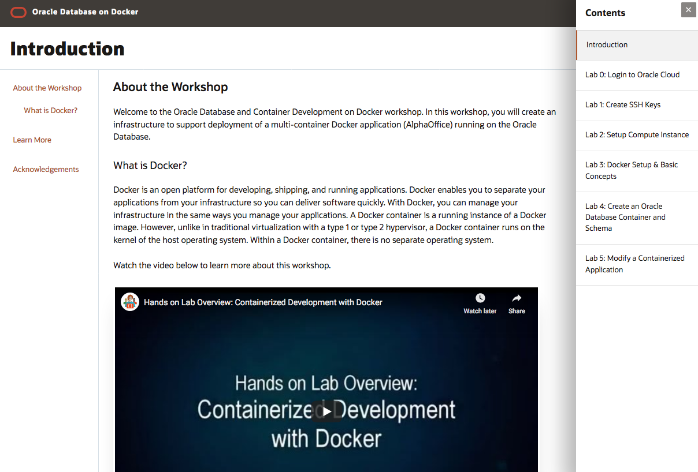

# Run a container application on the Oracle Database
## Introduction

Welcome to the Oracle Database on Docker Workshop. 

### About Docker

Docker is an open source container designed to separate an application from its host environment. Unlike virtual machines, which encapsulate the application and its operating system, Docker containers are much lighter weight. A Docker engine is required to run a Docker container. Docker engines are available for Windows and Linux platforms, including Oracle Linux. When you build a Docker image, it contains all of the code necessary for the application, including application code, runtime, system tools, libraries and settings. This means you can create and test an application in one environment - for example, your Windows PC and deploy it to the cloud. In addition, there pre-built Oracle images available on [Docker Hub](https://hub.docker.com/u/oracle/), so you can start with an existing image quickly.

### **Let's Get Started!**

### Access the Labs Using Our Web Interface
**Click the image to use our easy to navigate HTML format:**

