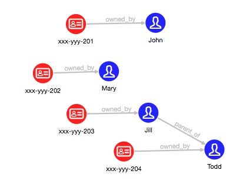
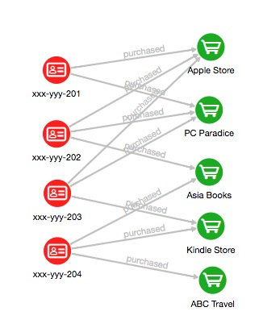
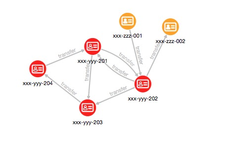
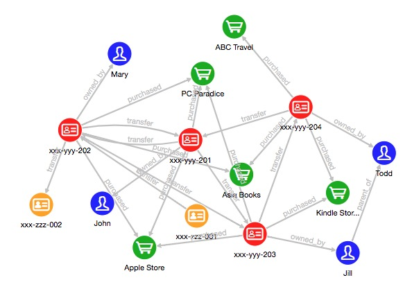

# Create Graph as Files #

Initial description 

## Disclaimer ##
The following is intended to outline our general product direction. It is intended for information purposes only, and may not be incorporated into any contract. It is not a commitment to deliver any material, code, or functionality, and should not be relied upon in making purchasing decisions. The development, release, and timing of any features or functionality described for Oracle’s products remains at the sole discretion of Oracle.


## Data Preparation
Go to `graphs/customer_360/` directory.

```$ <copy>cd graphs/customer_360/</copy>```

Check the following files. Those datasets are collected from different data sources, and converted to graph data format. Here, we use `.pg` format (detail).

    $ more master.pg
    $ more purchase.pg
    $ more transfer.pg
    
`master.pg`


```
# Nodes
101 type:customer name:"John" age:10 location:"Boston"
102 type:customer name:"Mary" gender:"F"
103 type:customer name:"Jill" location:"Boston"
104 type:customer name:"Todd" student:true
201 type:account account_no:"xxx-yyy-201" balance:1500
202 type:account account_no:"xxx-yyy-202" balance:200
203 type:account account_no:"xxx-yyy-203" balance:2100
204 type:account account_no:"xxx-yyy-204" balance:100

# Edges
201 -> 101 :owned_by since:"2015-10-04"
202 -> 102 :owned_by since:"2012-09-13"
203 -> 103 :owned_by since:"2016-02-04"
204 -> 104 :owned_by since:"2018-01-05"
103 -> 104 :parent_of
```




`purchase.pg`

```
# Nodes
301 type:merchant name:"Apple Store"
302 type:merchant name:"PC Paradise"
303 type:merchant name:"Kindle Store"
304 type:merchant name:"Asia Books"
305 type:merchant name:"ABC Travel"

# Edges
201 -> 301 :purchased amount:800
201 -> 302 :purchased amount:15
202 -> 301 :purchased amount:150
202 -> 302 :purchased amount:20
202 -> 304 :purchased amount:10
203 -> 301 :purchased amount:350
203 -> 302 :purchased amount:20
203 -> 303 :purchased amount:15
204 -> 303 :purchased amount:10
204 -> 304 :purchased amount:15
204 -> 305 :purchased amount:450
```



`transfer.pg`

```
# Nodes
211 type:account account_no:xxx-zzz-001
212 type:account account_no:xxx-zzz-002

# Edges
201 -> 202 :transfer amount:200 date:"2018-10-05"
211 -> 202 :transfer amount:900 date:"2018-10-06"
202 -> 212 :transfer amount:850 date:"2018-10-06"
201 -> 203 :transfer amount:500 date:"2018-10-07"
203 -> 204 :transfer amount:450 date:"2018-10-08"
204 -> 201 :transfer amount:400 date:"2018-10-09"
202 -> 203 :transfer amount:100 date:"2018-10-10"
202 -> 201 :transfer amount:300 date:"2018-10-10"
```




## Data Integration
We can simply concatenate the files.

    $ <copy>cat master.pg purchase.pg transfer.pg > all.pg</copy>




## Data Conversion
Convert the data into PGX format using pg2pgx tool ([detail](https://pg-format.readthedocs.io/en/latest/contents/pg-converters.html)).

    $ <copy>alias pg2pgx='docker run --rm -v $PWD:/work g2glab/pg:0.3.4 pg2pgx</copy>'
    
    $ <copy>pg2pgx all.pg</copy>

    "all.pgx.nodes" has been created.
    "all.pgx.edges" has been created.
    "all.pgx.json" has been created.

You will get the separate files for nodes and edges.
    
    $ more all.pgx.nodes
    $ more all.pgx.edges

## Next Step

Next step is [Load from Files](../load_from_files/load_from_files.md).


## Acknowledgements ##

- **Author** - Ryota Yamanaka - Product Manager in Asia-Pacific for geospatial and graph technologies