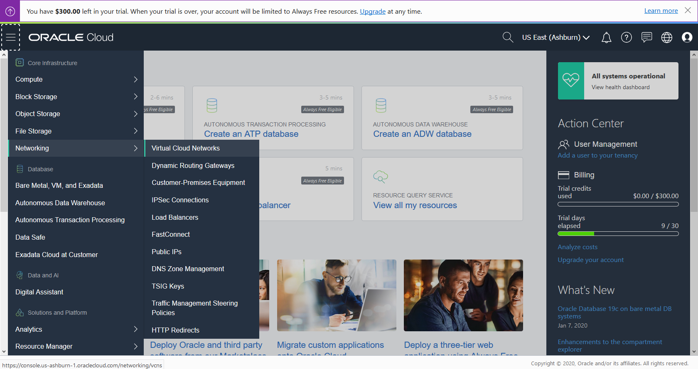

# Create an Oracle Cloud Virtual Cloud Network
## Before You Begin

This lab walks you through the steps to create an instance of an Oracle Virtual Cloud Network (VCN). A virtual cloud network (VCN) provides the necessary network Infrastructure required to support resources, including Oracle Database instances. This includes a gateway, route tables, security lists, DNS and so on. Fortunately, Oracle Cloud Infrastructure provides a wizard that simplifies the creation of a basic, public internet accessible VCN.

### What Do You Need?

* An Oracle Cloud paid account or free trial. To sign up for a trial account with $300 in credits for 30 days, click [here](http://oracle.com/cloud/free).

## **STEP 1**: Create a Virtual Cloud Network instance

1. From the Console menu, select **Networking > Virtual Cloud Networks**.

  

2. Select your compartment and click on **Networking Quickstart**. If you haven't created any compartments yet, just leave it as the default (root) compartment.

  

3. Be sure the default "VCN with Internet Connectivity" is selected and click **Start Workflow**.

  

4. Enter a name for your VCN, and enter the default values for the VCN CIDR block(10.0.0.0/16), Public Subnet CIDR block (10.0.0.0/24) and Private CIDR block (10.0.1.0/24), and click **Next**.

  

5. Review your selections on the next screen and click **Create**.

  

6. On the summary screen, click **View Virtual Cloud Network**.

  You can proceed to the next lab.

## Want to Learn More?

* [Oracle Cloud Infrastructure: Network Setup for DB Systems](https://docs.cloud.oracle.com/en-us/iaas/Content/Database/Tasks/network.htm)

## Acknowledgements
* **Author** -Tom McGinn, Learning Architect, Database User Assistance
* **Last Updated By/Date** - Tom McGinn, March 2020

See an issue?  Please open up a request [here](https://github.com/oracle/learning-library/issues).   Please include the workshop name and lab in your request. 
