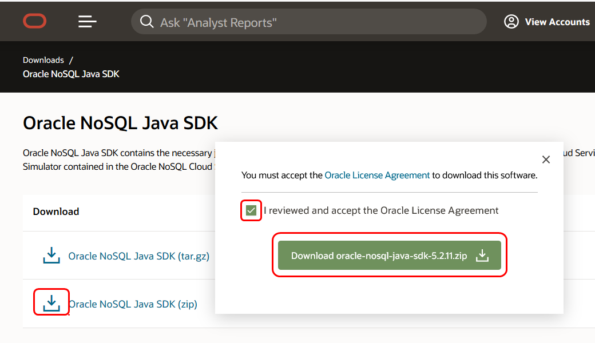
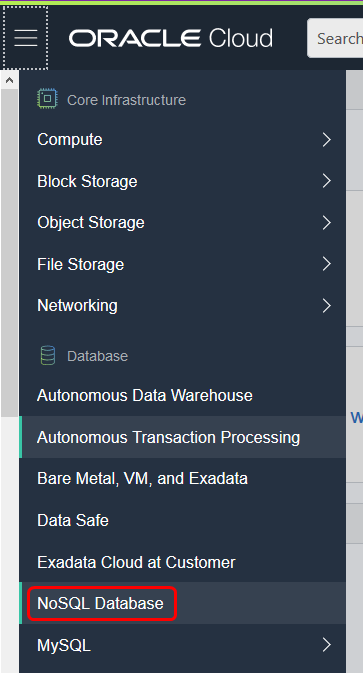
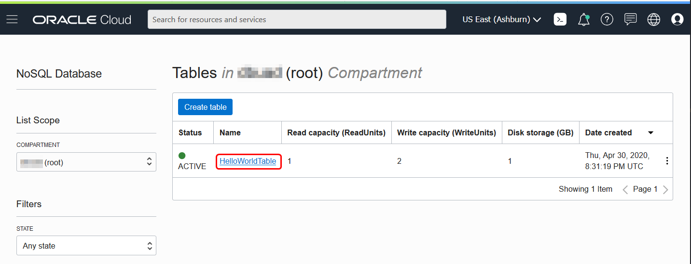
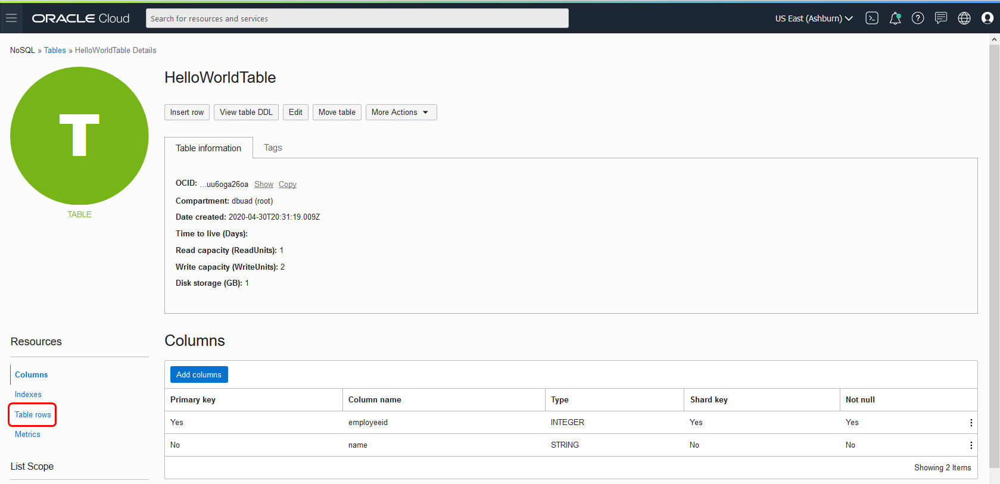

# Run the Sample NoSQL Application
## Before You Begin

This 10-minute lab walks you through the steps to create a sample HelloWorld application to connect to an Oracle NoSQL Database Cloud Service and perform basic table level operations.

### Background
Oracle NoSQL Database Cloud Service is a fully managed database cloud service that handles large amounts of data at high velocity. Developers can start using this service in minutes by following the simple steps outlined in this tutorial.

To get started with the service, you create a table.

### What Do You Need?

* An Oracle Cloud paid account or free trial. To sign up for a trial account with $300 in credits for 30 days, click [here](http://oracle.com/cloud/free).
* [Git Bash Shell](https://gitforwindows.org/) (Windows)
* An API Signing Key
* The fingerprint of the public key
* Your tenancy's Oracle Cloud Identifier (OCID)
* The OCID of your user account

## STEP 1: Download the Oracle NoSQL SDK

1. Open the [Oracle Cloud Download](https://www.oracle.com/downloads/cloud/oracle-cloud-downloads.html) page in a browser and click **Download Oracle NoSQL Java SDK**.

  

2. Select the Zip file, accept the license agreement and click **Download**.

  *Note: the version you download may be different than the image below.*

  

3. Save the zip file to your home (~) folder.

4. Open a shell (GitBash for Windows), and unzip the SDK:

    ```
    $ <copy>unzip oracle-nosql-java-sdk-5.2.11.zip</copy>
    Archive:  oracle-nosql-java-sdk-5.2.11.zip
      creating: oracle-nosql-java-sdk-5.2.11/
      creating: oracle-nosql-java-sdk-5.2.11/doc/
      creating: oracle-nosql-java-sdk-5.2.11/doc/javadoc/
      creating: oracle-nosql-java-sdk-5.2.11/doc/javadoc/jquery/
      ...
      inflating: oracle-nosql-java-sdk-5.2.11/lib/bcpkix-jdk15on.jar
      inflating: oracle-nosql-java-sdk-5.2.11/lib/bcprov-jdk15on.jar
      inflating: oracle-nosql-java-sdk-5.2.11/lib/guava.jar
      inflating: oracle-nosql-java-sdk-5.2.11/lib/jackson-core.jar
      inflating: oracle-nosql-java-sdk-5.2.11/lib/netty-all.jar
      inflating: oracle-nosql-java-sdk-5.2.11/lib/nosqldriver.jar
    $
    ```
## STEP 2: Download, build and run the sample application

1. Download the provided [HelloWorld.java](files/HelloWorld.java) file your home directory.

2. Review the sample application. You can access the [JavaAPI Reference Guide](https://docs.oracle.com/en/cloud/paas/nosql-cloud/csnjv/index.html) to reference Java classes, methods, and interfaces included in this sample application.

3. Use `vi` to create a `config` file. When `SignatureProvider` is constructed without any parameters, the default [SDK Configuration File](https://docs.cloud.oracle.com/iaas/Content/API/Concepts/sdkconfig.htm) is located in the `~/.oci/config`.

    ```
    $ <copy>vi ~/.oci/config</copy>
    $
    ```
4. Create the file with the following information:

    ```
    [DEFAULT]
    user=<user-ocid>
    fingerprint=<fingerprint value>
    tenancy=<tenancy-ocid>
    key_file=~/.oci/oci_api_key_private.pem
    pass_phrase=<key passphrase>
    ```

    Save the file.

5. Compile the sample application:

    *Note: Use your SDK driver version if it is different.*

    ```
    $ <copy>javac -cp "oracle-nosql-java-sdk-5.2.11/lib/*" HelloWorld.java</copy>
    $
    ```

6. Run the application:

    ```
    $ <copy>java -cp ".;oracle-nosql-java-sdk-5.2.11/lib/*" HelloWorld</copy>
    Creating table HelloWorldTable
    Waiting for HelloWorldTable to become active
    Table HelloWorldTable is active
    Wrote {"name":"Tracy","employeeid":1}
    Read {"employeeid":1,"name":"Tracy"}
    $
    ```

    Note: In the main method of `HelloWorld.java`, the `dropTable(handle)` is commented out to allow you to see the result of creating the tables in the Oracle Cloud Console.

## STEP 3: Explore tables using the Oracle Cloud Infrastructure Console

1. On the left hand menu, click **NoSQL Database**.

  

2. Click **HelloWorldTable** to open the details page.

  

3. Click **Table Rows** under Resources.

  

4. Click Run Query to execute the select statement and display the record inserted into the table:

  

Congratulations! You have completed the workshop.

Oracle NoSQL Database also supports Python, Node.js and Go. This application accesses Oracle NoSQL Cloud over HTTP, but most likely you would want to deploy by running your application inside your own tenancy co-located in the same Oracle Cloud Infrastructure region as your NoSQL table and use the Oracle Cloud Infrastructure Service Gateway to connect to the NoSQL Cloud Service.

## Want to Learn More?

* [About Oracle NoSQL Database Cloud Service](https://docs.oracle.com/pls/topic/lookup?ctx=cloud&id=CSNSD-GUID-88373C12-018E-4628-B241-2DFCB7B16DE8)
* [Oracle NoSQL Database Cloud Service page](https://cloud.oracle.com/en_US/nosql)
* [Java API Reference Guide](https://docs.oracle.com/en/cloud/paas/nosql-cloud/csnjv/index.html)

## Acknowledgements
* **Author** - Dave Rubin, Senior Director, NoSQL and Embedded Database Development and Michael Brey, Director, NoSQL Product Development
* **Adapted for Cloud by** -  Tom McGinn, Database User Assistance
* **Last Updated By/Date** - Tom McGinn, May 2020

See an issue?  Please open up a request [here](https://github.com/oracle/learning-library/issues).
