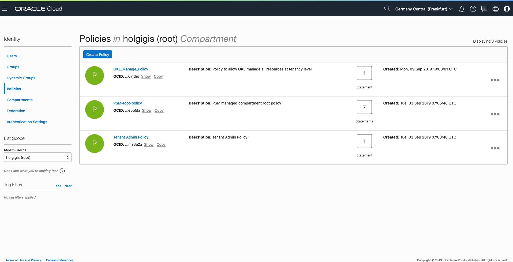
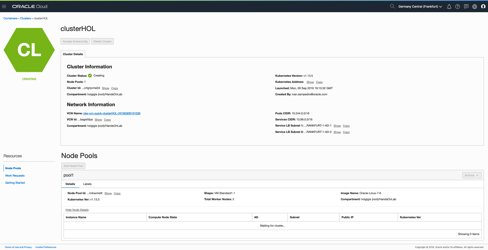

# Create a Kubernetes Cluster**

## Before You Begin

In this lab you will create a Kubernetes Cluster to deploy the microservices you will create in a later lab.

## **Step 1**: Create Policies

1. Start by creating a policy that allows Service OKE to be created to manage all resources in this tenancy. To do this in OCI Dashboard Menu go to Identity-\>Policies.

  

2. Check that root compartment is selected. Then click **Button Create Policy** and fill in fields taking special care of filling in Statement field in Policy Statements area with this value:

   ```
   <copy>Allow service OKE to manage all-resources in tenancy</copy>
   ```

3. And then click **Create**:

  

4. Then check that the policy has been created:

  

## **Step 2**: Create OKE Clusters

1. In OCI Dashboard Menu go to: Developer Services-\> Container Clusters (OKE)

  

2. Select the compartment you have previously created under List Scope and click **Create Cluster**:

  

3. Provide a name for the cluster, then select QUICK CREATE option and Launch Workflow button:

  

4. Select Shape VM.Standard1.1 and 3 (or less if you don't want to create a 3 workernodes nodepool) in the NUMBER OF NODES (this number is the VMs that will be created into the node pool). Then click **NEXT** setting the default options for the rest of parameters for a cluster review:

  

5. Review the cluster information before to create it, and click **Create Cluster** or back to modify cluster options:

  

6. The previous QUICK CREATE Option will setup a 3 nodes Kubernetes Cluster with predefined Virtual Cloud Network, 3 Subnets, Security Lists, Route tables. When you are done with checks, please click the Requesting Cluster area in your Cluster name.

  *Note: Cluster creation process can take several minutes.*

  

  

7. Then you are taken to the Cluster Information page. Please copy Cluster id and don’t forget to make a note in a txt file as you will need this data later:

  

8. It will take several minutes for the cluster to be created. Once created, if you scroll down in previous screen and select Node Pools under Resources area, you can check that a Node Pool with three Node Clusters have been created:

  

  *Note: you may find that Compute nodes have not been created yet as. This process can take several minutes as compute instances have to be created and then started:*

  

9. Now your Kubernetes Cluster is created. But we need to run some extra steps to get started with managing the Kubernetes Cluster.

  If you click under Resources section in Getting Started. This section explains steps to access to you Cluster dashboard by using Kubectl. In this section it is explained in detail how to install ocicli and kubectl to access to Kubernetes management tool:

  

  

  You can proceed to the next lab.

## Want to Learn More?

* [Oracle Developer Cloud Service Documentation](https://docs.oracle.com/en/cloud/paas/developer-cloud/index.html)
* [Oracle Container Engine for Kubernetes Documentation](https://docs.cloud.oracle.com/en-us/iaas/Content/ContEng/Concepts/contengoverview.htm)

## Acknowledgements
* **Authors** -  Iván Postigo, Jesus Guerra, Carlos Olivares - Oracle Spain SE Team
* **Last Updated By/Date** - Tom McGinn, April 2020

See an issue?  Please open up a request [here](https://github.com/oracle/learning-library/issues). Please include the workshop name and lab in your request.
